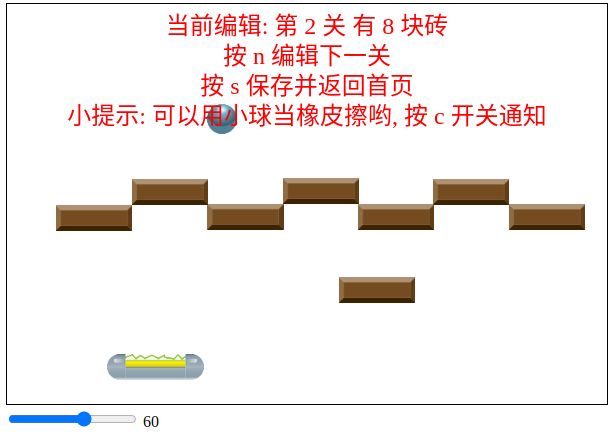

# HTML5 Game: STG(Shoot 'em up) and Breakout Clone

- STG (Deployed on [Github pages][gp])

[][gp]

- Breakout Clone(on brick branch)

## features:

- Editing modes for game designer
- Object-oriented programming and Modularization
- automate cut the spritesheet

## cons:

- Not really interesting:)

[gp]: https://huulane.github.io/HTML5-Game/
